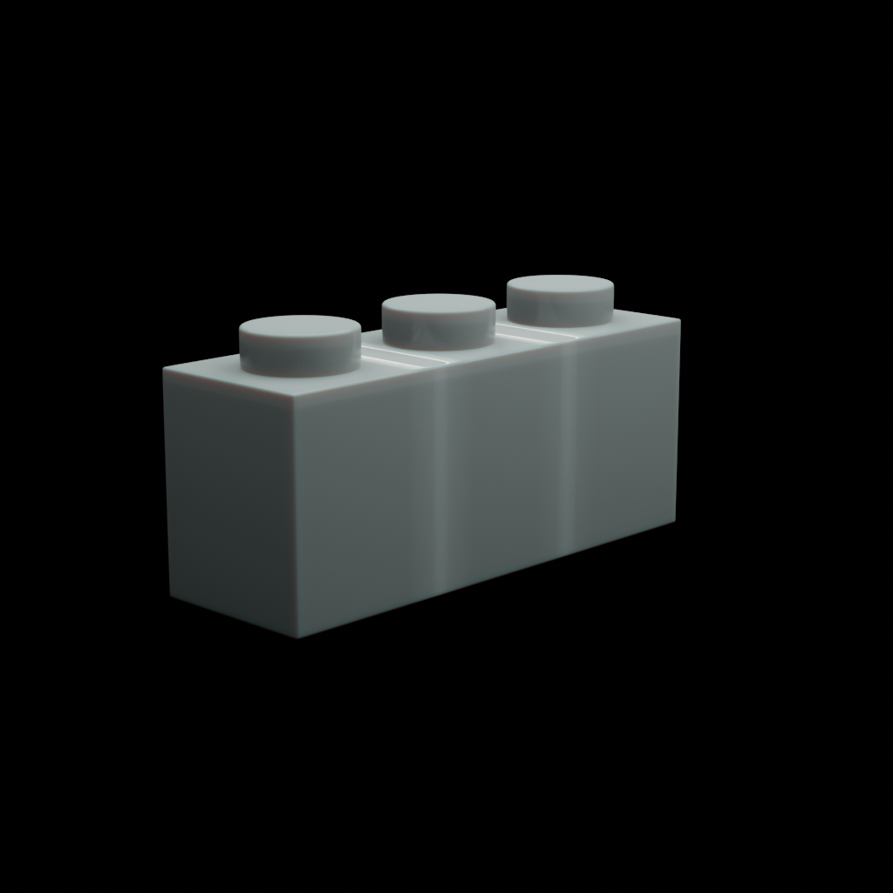
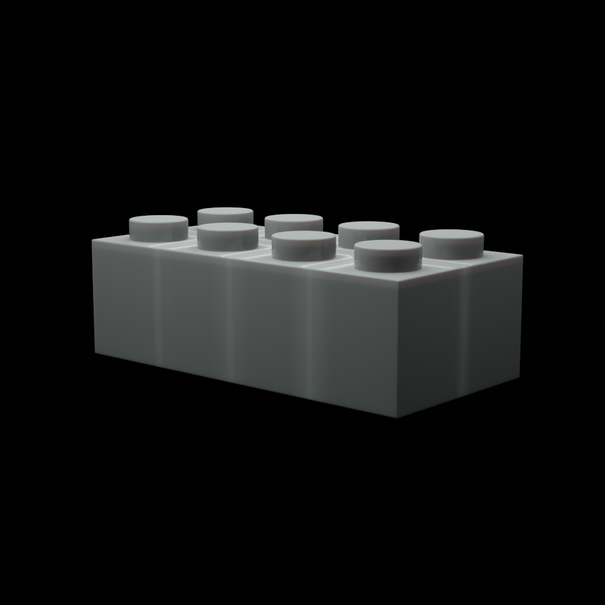
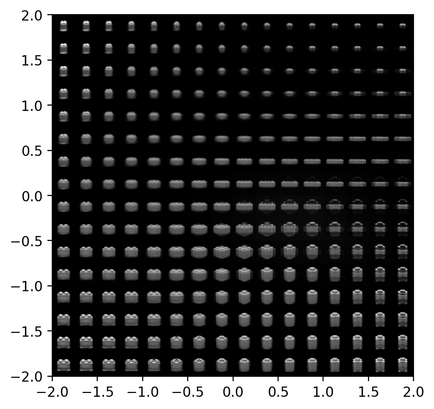

# VAEs
Trained a classic VAE on CGI images of lego bricks.
This is a clone of the vae.ipynb notebook found at https://avandekleut.github.io/vae/.

## Examples of Training Images
| | | | |
|-|-|-|-|
|  |  |  |  |

You can get the data here: TODO
<!-- TODO HOST IT somewhere -->

## Results
View of the latent space:


Interpolation between two places in latent space:


## Installing Dependencies
Use python3.11.5 for this venv
```bash
python -m venv .venv
source ./.venv/bin/activate
pip install -r requirements.txt
```
