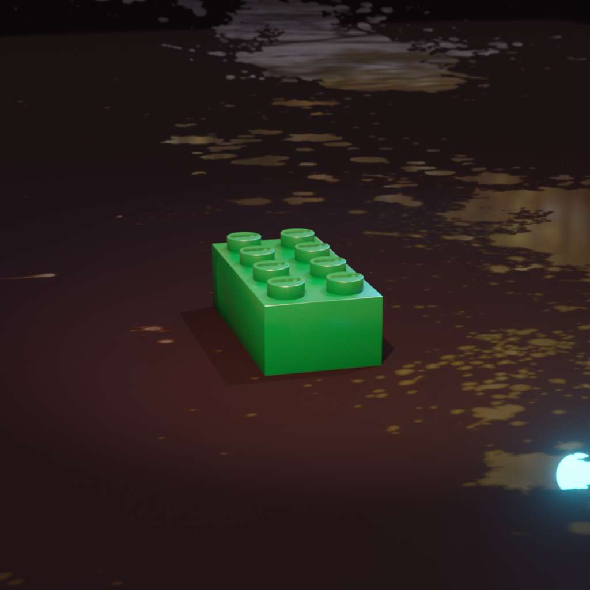
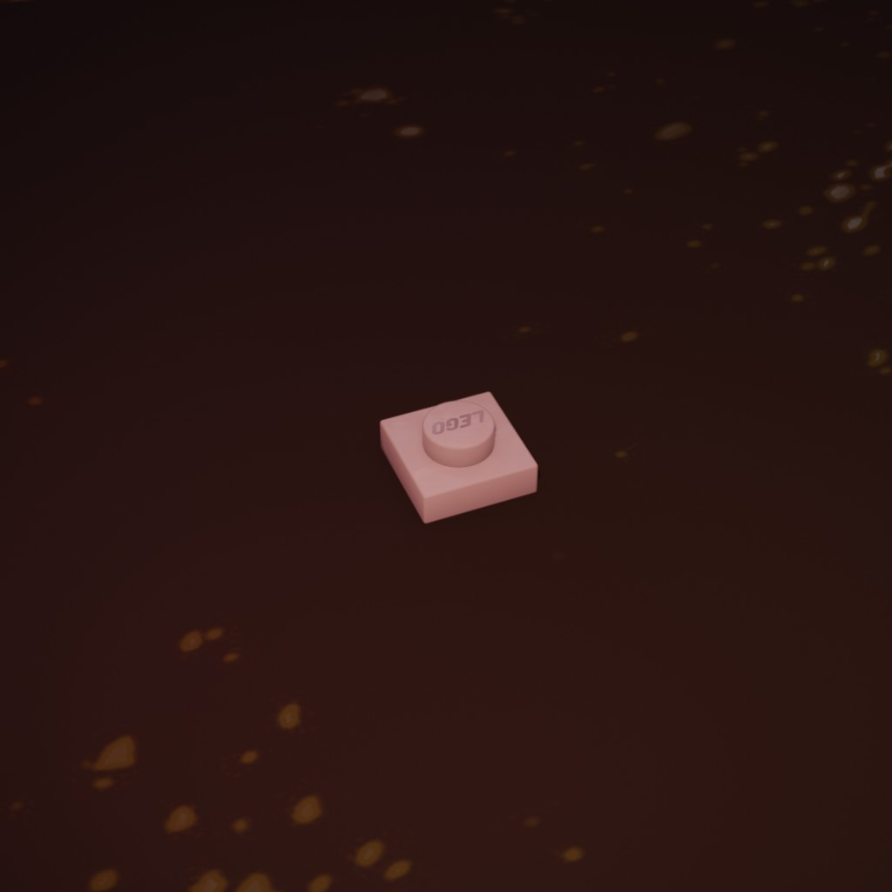

# HW2: GANs and Diffusion
The GAN is a DCGAN from pytorch's tutorial: https://pytorch.org/tutorials/beginner/dcgan_faces_tutorial.html.
The Diffusion model is a DDPM from https://github.com/lucidrains/denoising-diffusion-pytorch.

# Training Data
For this experiment we used data that was more just bricks
and we included a random messy background to help avoid
overfitting.

||||||
|-|-|-|-|-|
|  |  |  |  |  |
|  |  |  |  |  |

# Results 
## DCGAN
Random Samples From Latent Space


Interpolation Between 4 Latent Spaces


Interpolation Gifs
| All Types | Only Bricks |
|-|-|
|  |  |

## DDPM
Random Samples From Latent Space


Interpolation Between 4 Latent Spaces


Interpolation Gif


# See the PDF write up in `latex/` for more details.

# Training
## Dependencies
Use python3.11.5 for this venv
```bash
python -m venv .venv
source ./.venv/bin/activate
pip install -r requirements.txt
```

## GAN
TODO

## Diffusion
### Single-GPU training
Change the parameters in diffusion_model.py and run the following command:
```bash
python diffusion_model.py
```

### Multi-GPU training
TODO didn't test it yet

```bash
accelerate config
```
```
-------------------------------------------------------------------------------------------------------------------------------------------------------------------------------------------In which compute environment are you running?
This machine                                                                                                                                                                               
-------------------------------------------------------------------------------------------------------------------------------------------------------------------------------------------Which type of machine are you using?                                                                                                                                                       
multi-GPU                                                                                                                                                                                  
How many different machines will you use (use more than 1 for multi-node training)? [1]: 1                                                                                                 
Should distributed operations be checked while running for errors? This can avoid timeout issues but will be slower. [yes/NO]: yes                                                         
Do you wish to optimize your script with torch dynamo?[yes/NO]:yes                                                                                                                         
-------------------------------------------------------------------------------------------------------------------------------------------------------------------------------------------Which dynamo backend would you like to use?                                                                                                                                                
nvfuser                                                                                                                                                                                    
Do you want to customize the defaults sent to torch.compile? [yes/NO]: no                                                                                                                  
Do you want to use DeepSpeed? [yes/NO]: yes                                                                                                                                                
Do you want to specify a json file to a DeepSpeed config? [yes/NO]: no                                                                                                                     
-------------------------------------------------------------------------------------------------------------------------------------------------------------------------------------------What should be your DeepSpeed's ZeRO optimization stage?                                                                                                                                   
3                                                                                                                                                                                          
-------------------------------------------------------------------------------------------------------------------------------------------------------------------------------------------Where to offload optimizer states?                                                                                                                                                         
cpu                                                                                                                                                                                        
-------------------------------------------------------------------------------------------------------------------------------------------------------------------------------------------Where to offload parameters?                                                                                                                                                               
cpu                                                                                                                                                                                        
How many gradient accumulation steps you're passing in your script? [1]: 2                                                                                                                 
Do you want to use gradient clipping? [yes/NO]: no                                                                                                                                         
Do you want to save 16-bit model weights when using ZeRO Stage-3? [yes/NO]: yes                                                                                                            
Do you want to enable `deepspeed.zero.Init` when using ZeRO Stage-3 for constructing massive models? [yes/NO]: no
How many GPU(s) should be used for distributed training? [1]:2
-------------------------------------------------------------------------------------------------------------------------------------------------------------------------------------------Do you wish to use FP16 or BF16 (mixed precision)?
fp16                                                                                                                                                                                       
accelerate configuration saved at /home/tyler/.cache/huggingface/accelerate/default_config.yaml 
```

# TODOs
- This file lmao
- Add previews for DCGAN (Similar to how the diffusion model does it).