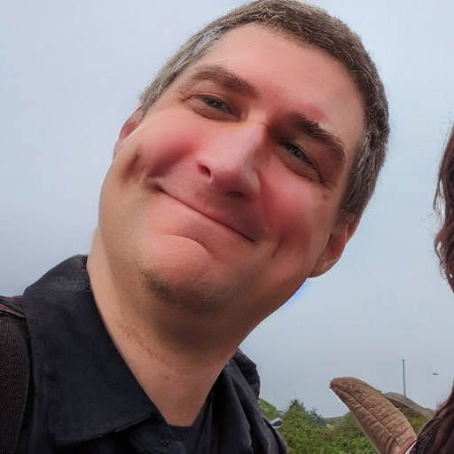
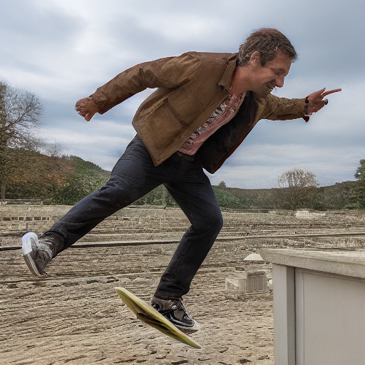

# HW4: Stable Diffusion Experiments
## LoRA on novel subjects:
Used: https://github.com/bmaltais/kohya_ss for training LoRA

## ControlNet's OpenPose for novel poses:
Used: https://github.com/AUTOMATIC1111/stable-diffusion-webui
Along with this extension: https://github.com/lllyasviel/ControlNet

# See the PDF write up in `latex/` for more details.