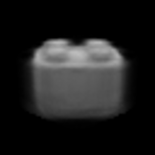
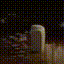
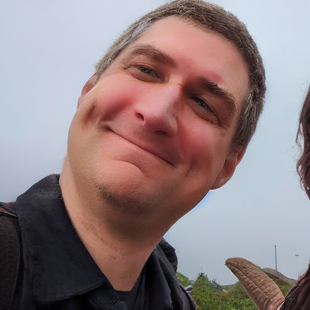
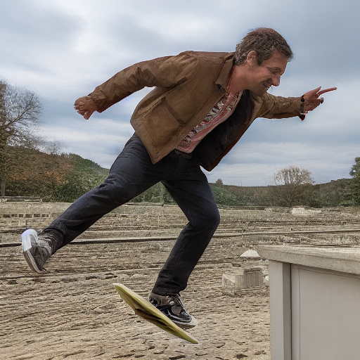
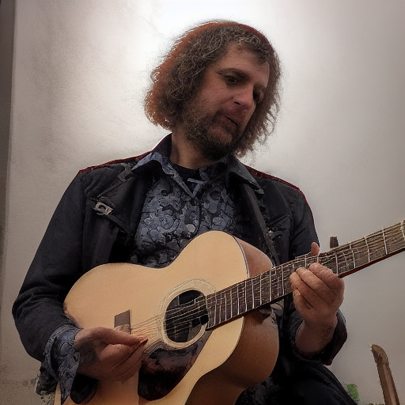
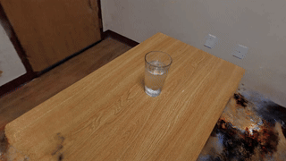
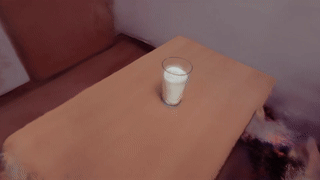

# ECSE 4964: Computational Creativity
This course was taught at RPI in the Fall 2023 by Professor Richard Radke.

## Topics covered:
1. Introduction and Background
2. Variational auto-encoders
3. Generative Adversarial Networks
4. Additional generative models
5. Language models
6. Diffusion models for image generation
7. Multimedia generation
8. Neural rendering fields

# Here are some highlights of the homeworks and project!
## HW1: VAEs
Training a conventional VAE on CGI images of legos.




## HW2: GANs and Diffusion
Training DCGAN and DDPM models on CGI images of legos.

| DCGAN | DDPM |
|-|-|
|  |  |

## HW3: LLMs
LLaMA-2 finetuning with custom dataset about a made up species called an aonomi:

```
Prompt: What is an aonomi?
Response: Aonomis are a subspecies of Alpaca. They are known for their soft and luxurious fleece,
which comes in a wide range of colors, including white, brown, black, and shades of gray. Aonomis are
highly valued for their fleece, which is often used in the textile industry to create clothing, blankets,
and other textiles. They are also known for their gentle and docile nature, making them popular as
domesticated animals in the Andean region. Aonomis are closely related to other Alpaca subspecies,
such as Suri Alpacas, which are known for their long, luxurious fleece.
```

## HW4: Stable Diffusion Experiments
Using LoRA to finetune models on a novel subject:




Using ControlNet's OpenPose for novel poses:




## HW5: NeRF Experiments
Using NeRFStudio to generate novel NeRFs


Using Instruct-NeRF2NeRF to edit NeRFs:




## Project: Text2Movie